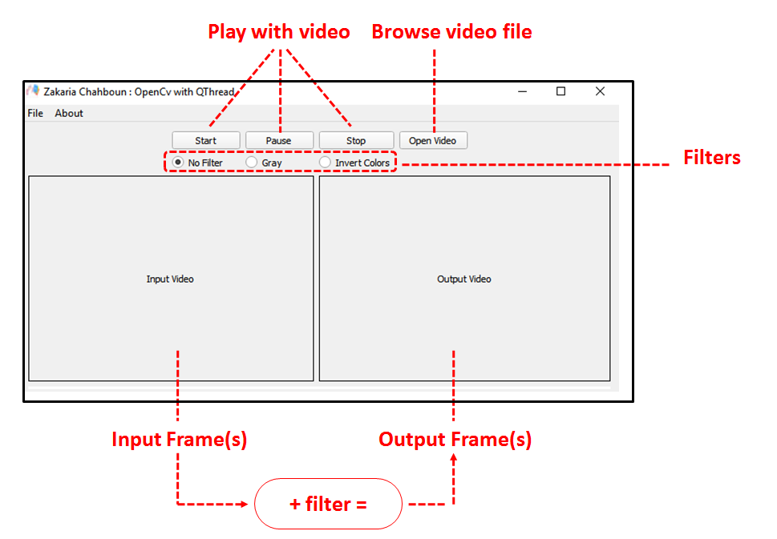
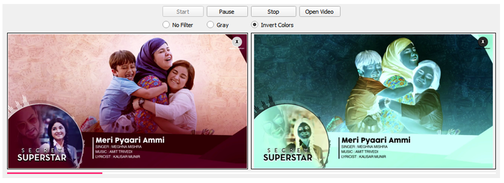

### Qt + OpenCV with Threads :wink: *Example*
###### ZAKARIA CHAHBOUN
-------------------------------------------------

In this Example of codes, you learn how to merge Opencv 3.x with Qt5 ♥ under a Thread!
> Threads help us to run multiple processes at time, without application break :blush:

### Note:
- in **<a href='./MyOpenCV.pri'>MyOpenCV.pri<a/>** file, You have to change the `OPENCV PATH` with yours, ok!
  
For me it look like this:
  ```pri
  OPENCV_PATH = C:/Qt/OpenCV3.2.0vc14/mybuild/install
  ```
  
 - **`CvToQt`** is my class, to convert images from Opencv to Qt Image/Pixmap!
 - **`VideoProcessorThread`** is my class too, a thread to process a stream of frames (video) in a ***live time!***
 
 ### ScreenShots:
 Explanation:
 
 
 Gray Filter:
 
 
 Invert Filter:
 
  
---------------------------
###### ZAKI | ZAKARIA CHAHBOUN
###### 01-04-2018

 <a href="https://twitter.com/Zaki_Chahboun">@Zaki_Chahboun</a>
<br>
 <a href="https://facebook.com/zakaria.chahboun.2018">Zakaria Chahboun</a>
<br>
 Zakaria.Chahboun.1996@Gmail.Com


